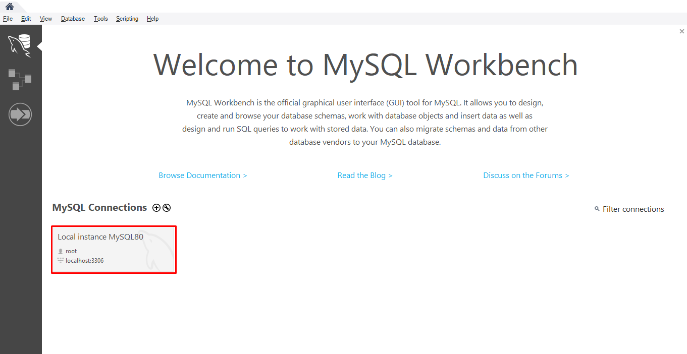
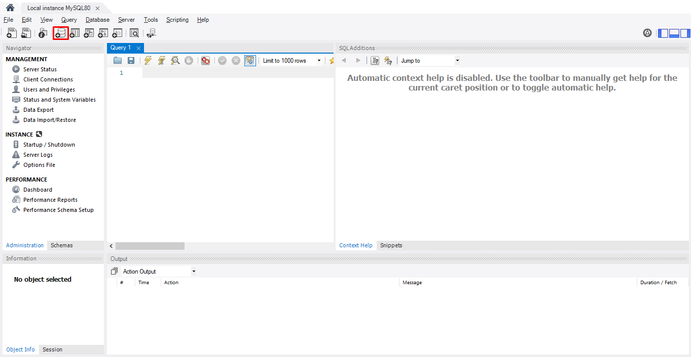
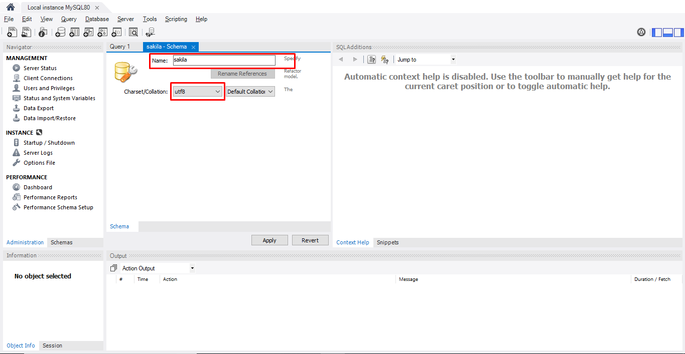
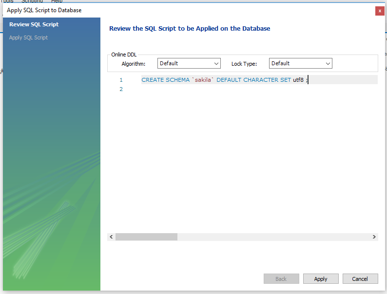
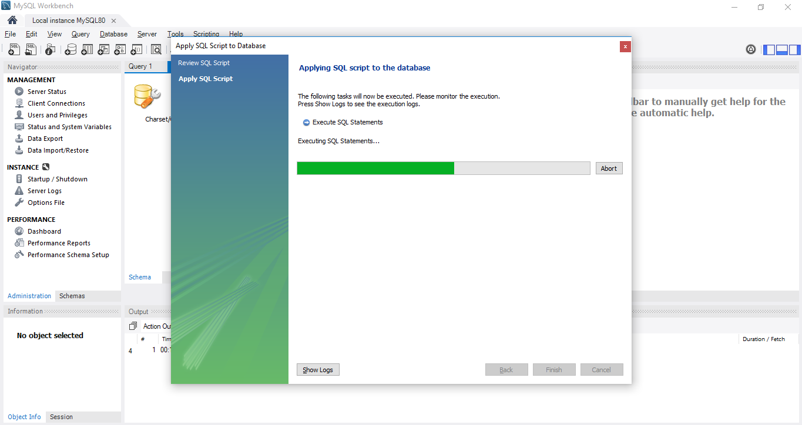
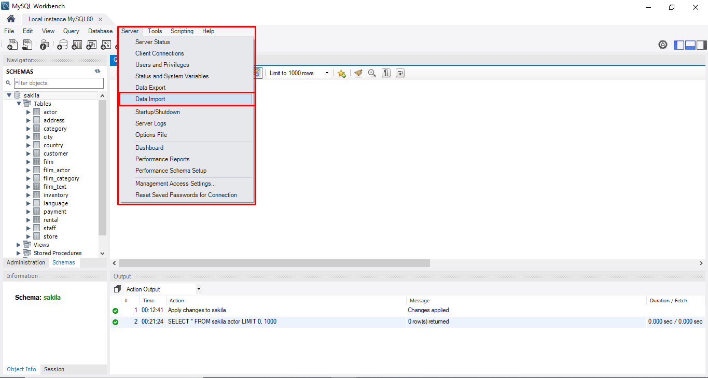
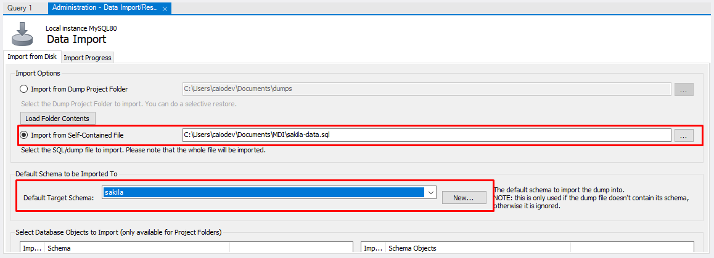
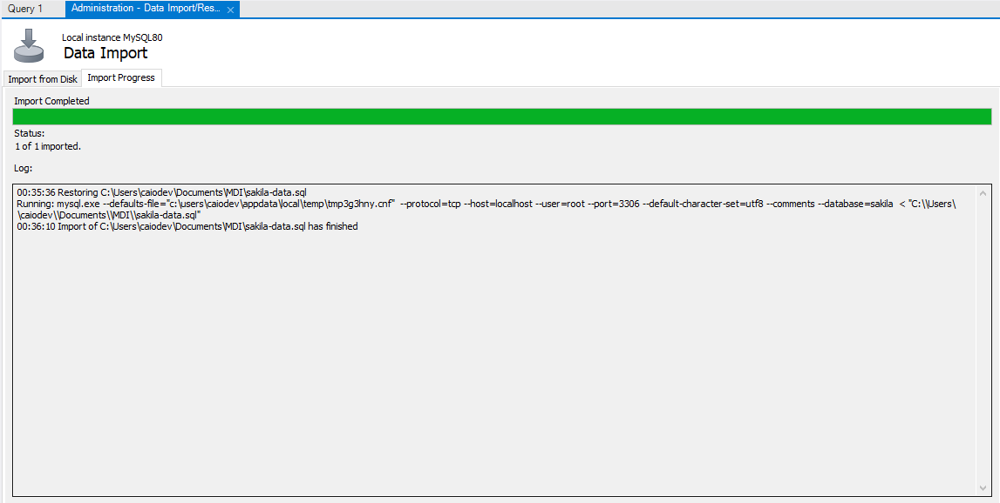
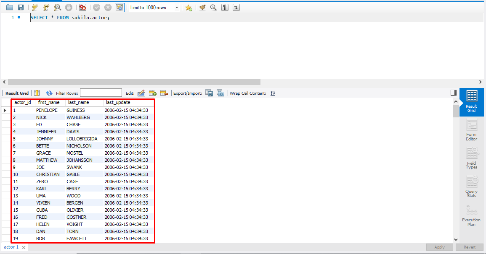

## Exemplo simples da criação de um data warehouse

### Requisitos
- Nesse exemplo os softwares será para plataforma Windows
- Mysql ( preferivel mais recente )
  -  [download](https://dev.mysql.com/downloads/windows/)
- Pentaho data integration
  - [download](https://community.hitachivantara.com/docs/DOC-1009855-data-integration-kettle)

### 1 - Importando sakila via Mysql Workbench
#### 1.1 - Inicie seu Mysql Workbench
#### 1.2 - Na tela inicial do workbench, clique na conexão local que ja existe.

#### 1.3 - Crie um novo database chamado 'sakila' e escolha charset 'utf8'

#### 1.4 - Copie o script de criação do sakila [schema](https://github.com/antoniomralmeida/mdi/blob/master/sakila-schema.sql) e em seguida cole para criação do database sakila.

#### 1.5 - Em seguida iremos fazer o restore do dump do sakila
  - Faça download do [dump](https://raw.githubusercontent.com/antoniomralmeida/mdi/master/sakila-data.sql)
  - Em seguida, escolha o arquivo do dump aonde você fez o download
  - Não esqueça de apontar para o database 'sakila'
  

#### 1.6 - Se tudo ocorrer bem, o processo vai terminar assim

#### 1.7 - Para confirmar se seu restore deu certo, clique com botão direito em alguma tabela e clique em 'select rows - limit 100'

Se você chegou até aqui sem nenhum erro, você conseguiu importar o sakila database em seu mysql :bowtie:
